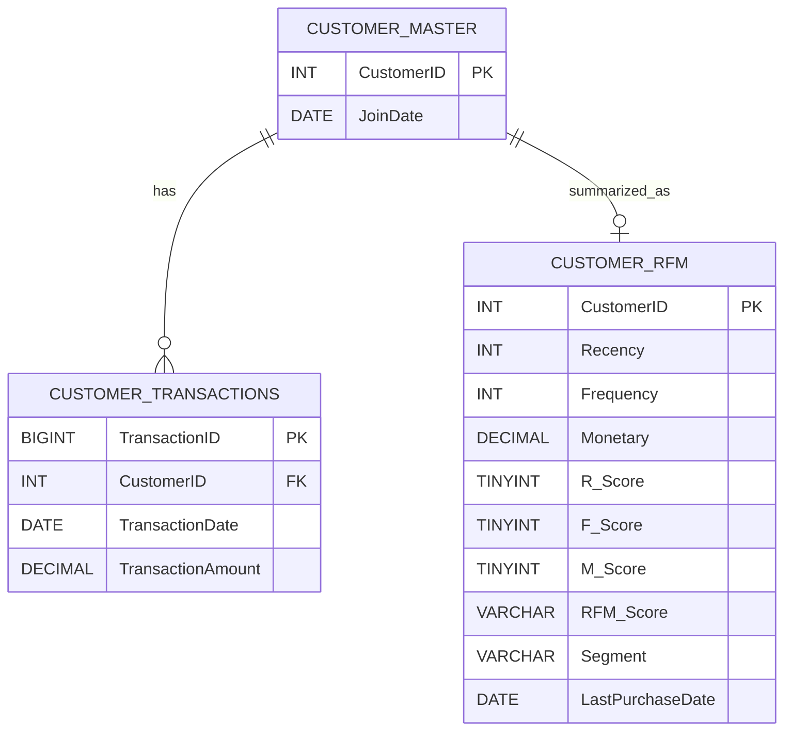

# RFM Customer Segmentation ERD

```mermaid
erDiagram
    CUSTOMER_MASTER ||--o{ CUSTOMER_TRANSACTIONS : has
    CUSTOMER_MASTER ||--o| CUSTOMER_RFM : summarized_as

    CUSTOMER_MASTER {
        INT CustomerID PK
        DATE JoinDate
    }

    CUSTOMER_TRANSACTIONS {
        BIGINT TransactionID PK
        INT CustomerID FK
        DATE TransactionDate
        DECIMAL TransactionAmount
    }

    CUSTOMER_RFM {
        INT CustomerID PK
        INT Recency
        INT Frequency
        DECIMAL Monetary
        TINYINT R_Score
        TINYINT F_Score
        TINYINT M_Score
        VARCHAR RFM_Score
        VARCHAR Segment
        DATE LastPurchaseDate
    }
```
